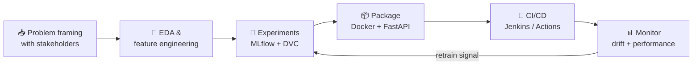

<!-- HEADER -->
<a href="https://github.com/ghoshpronay18071997">
  
</a>

<p align="center">
  <a href="https://github.com/ghoshpronay18071997?tab=followers"></a>
  
  <a href="https://github.com/ghoshpronay18071997?tab=repositories"></a>
</p>

<p align="center">
  
</p>

---

### 🧭 About me

```yaml
Name: Pronay Ghosh
Role: Data Scientist · AI Engineer
Domain: [GenAI & Agentic AI, MLOps, NLP, Computer Vision]
Location: Kolkata, India
Company: Aria Intelligent Solutions
Experience: 7+ years
Education: "B.Tech, Electrical Engineering - KIIT University, Bhubaneswar"
Shipped: "Agentic vision engine, price-optimization engine, GenAI document parsers"
Core Stack: [Python, PyTorch, TensorFlow, LangGraph, CrewAI, MLflow, DVC, Docker, FastAPI]
Clouds: [AWS, Azure]
Open To: AI/ML engineering roles, GenAI consulting, and hard data problems
```

- 🤖&nbsp; **Data Scientist @ Aria Intelligent Solutions** — translating ambiguous business problems into deployed ML systems: sentiment analysis, topic modelling, text classification, and end-to-end delivery through QA and stakeholder sign-off.
- 🧠&nbsp; Build **Agentic AI** systems with `LangGraph`, `CrewAI` and `MCP` — RAG pipelines over `FAISS` / `ChromaDB` / `Pinecone`, and fine-tuning with **PEFT (LoRA / QLoRA)**.
- 🚀&nbsp; Set up **MLOps pipelines from staging to production** — `MLflow` + `DVC` + `DagsHub` for tracking and lineage, `Docker` + Jenkins CI/CD for delivery, with automated monitoring.
- 👥&nbsp; **Led a team of 5** building a secure NLP + Computer Vision system for influencer marketing at Aidetic.
- 📚&nbsp; Former **Data Science Researcher @ INSAID** — authored industry AI/ML case studies, pre-reads and teaching material used across cohorts.
- 💼&nbsp; Freelanced for a **Colorado-based hedge fund** (finance valuation application) and built a **GenAI real-estate deed parsing system** for a consulting client.
- 🧱&nbsp; I care about **reproducibility**, **monitoring**, and models that survive contact with production — not just a good validation score.

---

### 🏗️ What I build

<table>
  <tr>
    <td valign="top">
      <h3>👁️ HarmonIQ — Vision IQ &nbsp;<sub><i>- agentic visual intelligence</i></sub></h3>
      <b>Proprietary Agentic AI engine.</b> Turns unstructured product imagery into structured, machine-readable data for e-commerce. Computer-vision pipelines autonomously extract granular attributes — colour, pattern, texture, shape — replacing manual tagging with high-speed automated analysis. Generative <b>Virtual Testing</b> lets creative teams simulate new designs and product variations without physical photoshoots.
      <br/><br/>
      <sub><code>Python</code> · <code>CrewAI</code> · <code>Claude Sonnet 4.5</code> · <code>Computer Vision</code> · <code>FastAPI</code> · <code>PostgreSQL</code> · <code>DVC</code> · <code>Jenkins</code> · <code>Docker</code></sub>
      <br/><br/>
      
      
    </td>
  </tr>
</table>

**Also built &amp; shipped**

<table>
  <tr>
    <td valign="top" width="33%">
      <h4>💷 Price Recommendation Engine</h4>
      <b>Travis Perkins.</b> Price-elasticity engine estimating sensitivity at product–customer-segment level, plus a constrained optimisation solver (linear/non-linear programming) recommending margin-maximising price points inside business and competitive guardrails. Serves real-time and batch recommendations across thousands of SKUs.
      <br/><br/><sub><code>XGBoost</code> · <code>LightGBM</code> · <code>MLflow</code> · <code>DVC</code> · <code>Jenkins</code> · <code>FastAPI</code></sub>
    </td>
    <td valign="top" width="33%">
      <h4>🧾 eBay Pillar 2 Engine</h4>
      Data pipelines aggregating dispersed financial data, with Python + Selenium ETL extracting and mapping <b>100+ data points</b> for jurisdictional Effective Tax Rate calculations. Regulatory rules translated into SQL/Python logic, with validation frameworks bridging local GAAP and GloBE reporting.
      <br/><br/><sub><code>Python</code> · <code>Selenium</code> · <code>PostgreSQL</code> · <code>Azure App Service</code> · <code>Flask</code></sub>
    </td>
    <td valign="top" width="33%">
      <h4>📘 Knowledgehook Recommender</h4>
      Textbook recommendation system built on the <b>BiVAE</b> model from Microsoft Recommenders, with text preprocessing for lift and an inference pipeline designed to survive the cold-start problem. Deployed as an Azure App Service.
      <br/><br/><sub><code>BiVAE</code> · <code>Microsoft Recommenders</code> · <code>Azure</code></sub>
    </td>
  </tr>
</table>

<table>
  <tr>
    <td valign="top" width="50%">
      <h4>📄 GenAI PDF Parsing (Fintech)</h4>
      GenAI-powered document parsing system built on Nanonets for a fintech client — extracting structured fields from noisy, real-world financial PDFs.
      <br/><br/><sub><code>GenAI</code> · <code>Nanonets</code> · <code>Python</code></sub>
    </td>
    <td valign="top" width="50%">
      <h4>🏠 Real-Estate Deed Parser</h4>
      GenAI deed-parsing system delivered on contract for Omniminds Consulting, built to client extraction standards.
      <br/><br/><sub><code>LLMs</code> · <code>NLP</code> · <code>Python</code></sub>
    </td>
  </tr>
</table>

---

### 🛠️ Tech I build with

**Languages &amp; Data**

<p>
  
  
  
  
  
  
</p>

**Machine Learning &amp; Deep Learning**

<p>
  
  
  
  
  
  
  
</p>

**GenAI &amp; Agentic AI**

<p>
  
  
  
  
  
  
  
  
  
  
</p>

**Vector Databases**

<p>
  
  
  
</p>

**MLOps &amp; Deployment**

<p>
  
  
  
  
  
  
  
  
  
</p>

**Cloud &amp; BI**

<p>
  
  
  
  
  
</p>

---

### 🧬 How I ship a model



---

### 🚀 Latest open source

<!-- PROJECTS:START -->
<!-- This section is generated automatically. Do not edit by hand. -->

<table><tr>
<td valign="top" width="50%">

#### [simple-qna-chatbot-using-langchain](https://github.com/ghoshpronay18071997/simple-qna-chatbot-using-langchain)
Question-answering chatbot built on LangChain - prompt templates, chained LLM calls and a minimal serving layer.

<sub>`Python` · ⭐ 0 · 🍴 0</sub>

</td>
<td valign="top" width="50%">

#### [Conversational-Chatbot-with-Gemini-Pro](https://github.com/ghoshpronay18071997/Conversational-Chatbot-with-Gemini-Pro)
Multi-turn conversational assistant on Google Gemini Pro, with chat history handling and streamed responses.

<sub>`Python` · ⭐ 0 · 🍴 0</sub>

</td>
</tr><tr>
<td valign="top" width="50%">

#### [multimodal-content-genrator](https://github.com/ghoshpronay18071997/multimodal-content-genrator)
Multimodal content generator - text and image prompts in, generated creative assets out.

<sub>`HTML` · ⭐ 0 · 🍴 0</sub>

</td>
<td valign="top" width="50%">

#### [SemanticSearchEngine](https://github.com/ghoshpronay18071997/SemanticSearchEngine)
Semantic search over a document corpus - embeddings plus vector similarity instead of keyword matching.

<sub>⭐ 0 · 🍴 0</sub>

</td>
</tr><tr>
<td valign="top" width="50%">

#### [my_new_repo](https://github.com/ghoshpronay18071997/my_new_repo)
Exploratory data analysis for a home-price prediction problem - distributions, correlations and feature insights.

<sub>`Jupyter Notebook` · ⭐ 0 · 🍴 0</sub>

</td>
<td valign="top" width="50%">

#### [spam-ham-using-transformers](https://github.com/ghoshpronay18071997/spam-ham-using-transformers)
Spam vs. ham classification with transformer models - fine-tuned encoder on labelled SMS/email text.

<sub>⭐ 0 · 🍴 0</sub>

</td>
</tr></table>

<sub>Last updated: 2026-08-29 · auto-generated from public repositories.</sub>
<!-- PROJECTS:END -->

<p align="center">
  <a href="https://github.com/ghoshpronay18071997?tab=repositories">
    
  </a>
</p>

---

### 📊 GitHub in numbers

<p align="center">
  
</p>

<p align="center">
  
  
</p>

<p align="center">
  
  
</p>

<p align="center">
  
</p>

<p align="center"><sub>📌 The cards above are generated daily by a GitHub Action and committed to this repo — served from GitHub itself, so they never rate-limit or break.</sub></p>

---

### 🐍 Contribution graph

<p align="center">
  
</p>

---

### 🎓 Learning &amp; certifications

- 🧰&nbsp; **Complete MLOps Bootcamp** — Krish Naik *(ongoing)*
- 🤖&nbsp; **Machine Learning A–Z** — Udemy
- 📈&nbsp; **The Data Science Course 2020** — Udemy
- 🛠️&nbsp; **Machine Learning Training** — Internshala

---

### 🤝 Let's connect

<p align="center">
  <a href="https://www.linkedin.com/in/pronay-ghosh-33200a128/"></a>
  <a href="mailto:ghosh.pronay18071997@gmail.com"></a>
  <a href="https://github.com/ghoshpronay18071997"></a>
  
</p>

<p align="center"><i>"In God we trust. All others must bring data."</i> — W. Edwards Deming</p>


